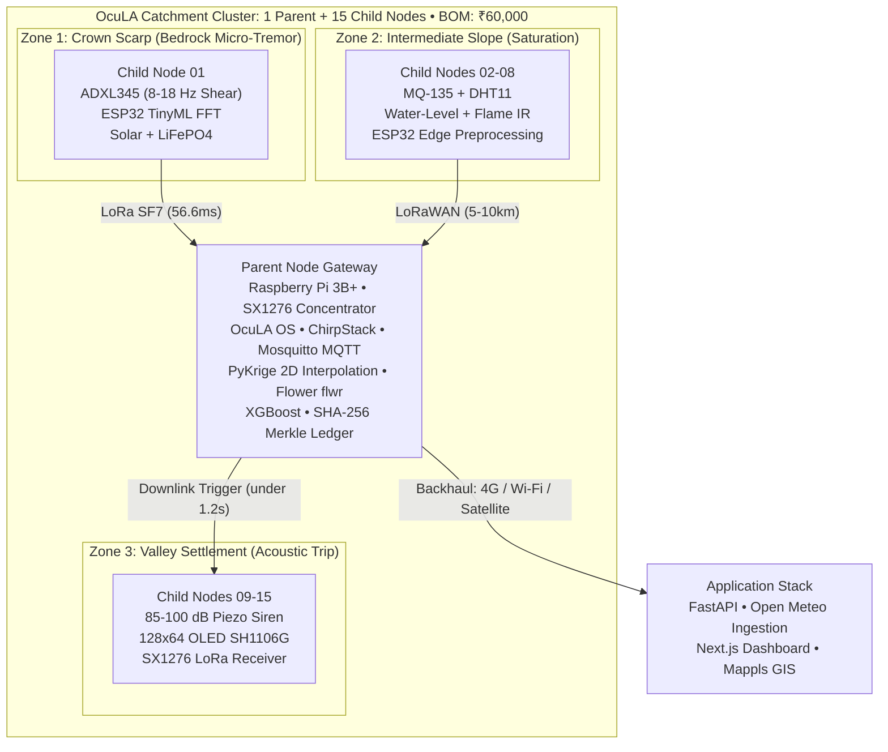

<div align="center">

# 🌐 OcuLA: Ocular Layer Architecture
### *Autonomous Multi-Hazard Environmental Intelligence, Physical Edge Telemetry & Real-Time GIS Disaster Mapping Network*

[](https://sih.gov.in/)
[](https://sih.gov.in/)
[](https://sih.gov.in/)
[](https://ocula.co.in)
[](https://vercel.com)
[](https://www.arduino.cc/)

---

### 🚀 Direct Links & Quick Access

| Resource | Description | Direct Access |
|---|---|:---:|
| 🌐 **Live Web Application** | Real-time multi-hazard GIS, 3D globe & USB sensor streaming | [**Launch Web App**](https://ocula.co.in) |
| 🛡️ **Audit Command Center** | Multi-device tracking, killswitch actuation & security logs | [**Launch Audit Hub**](https://ocula.co.in/audit) |
| 📄 **README Platform Guide (PDF)** | Complete standalone documentation in printable PDF format | [**Download README.pdf**](README.pdf) |
| 📑 **12-Page Research Dossier (PDF)** | Geotechnical stability, evacuation dynamics & counterfactual study | [**Download Dossier (PDF)**](ocula_wayanad_methodology.pdf) |
| 📽️ **Presentation Slide Deck** | Official SIH 2026 pitch deck and architecture summary | [**Download Deck (PDF)**](presentation/The_Code_Alchemists_SIH2026.pdf) |

</div>

---

## 📖 Table of Contents
1. [Core Platform Software & Codebase](#-core-platform-software--codebase)
   - [1. OCULA Web Application (`ocula-web-app/`)](#1-ocula-web-application-ocula-web-app)
   - [2. OCULA Audit Hub (`ocula-audit-hub/`)](#2-ocula-audit-hub-ocula-audit-hub)
2. [System Architecture & Dataflow](#-system-architecture--dataflow)
3. [Physical Hardware & WebSerial USB Telemetry](#-physical-hardware--webserial-usb-telemetry)
4. [Repository File Organization](#-repository-file-organization)
5. [Complimentary Research, Presentation & Visual Assets](#-complimentary-research-presentation--visual-assets)
   - [Direct Access Asset Directory](#direct-access-asset-directory)
   - [Dossier Page Previews](#dossier-page-previews)
6. [Deployment & Continuous Integration via Vercel](#-deployment--continuous-integration-via-vercel)
7. [Deployment Economics & BOM Audit](#-deployment-economics--bom-audit)
8. [License & Acknowledgments](#-license--acknowledgments)

---

## 💻 Core Platform Software & Codebase

The OcuLA codebase comprises two production single-page applications (SPAs) optimized for high-performance edge streaming, zero-latency physical hardware access, and military-grade audit provenance.

### 1. OCULA Web Application (`ocula-web-app/`)
*Production Link: [ocula.co.in](https://ocula.co.in) • Source Directory: [`ocula-web-app/`](ocula-web-app/)*

The primary public-facing portal for citizens, regional disaster authorities, and field researchers.

* **Live Hardware USB Sensor Streaming**: Native **WebSerial API** integration allows users to plug any Arduino Uno R4, ESP32, or STM32 microcontroller directly into a laptop/PC and stream physical environmental metrics without installing background drivers or software.
* **Universal Serial Frame Parsing**: Ingests raw serial data across JSON, CSV comma-separated streams, key-value pairs (`AQI:85,TEMP:28.4`), and raw ADC analog values.
* **Interactive Multi-Hazard GIS Map**: Built on an ultra-smooth vector Leaflet engine with Google English Vector tiles and OpenStreetMap fallback. Visualizes **60+ worldwide & regional hotspots** across **7 hazard layers**:
  1. 🌊 **Flood Hazard Inundation**: Real-time river basin telemetry and water-level alarms.
  2. 🔥 **Wildfire & Thermal Spots**: Active thermal anomaly monitoring with perimeter tagging.
  3. ⛰️ **Landslide Susceptibility**: Micro-tremor seismic thresholds and saturation indexes.
  4. 🌫️ **Air Quality (AQI / PM2.5 / PM10)**: Real-time particulate concentration heatmap.
  5. 🌡️ **Extreme Temperatures**: Cold wave & heat stress thermal tracking.
  6. ⚡ **Earthquake Seismicity**: Real-time epicenter plotting and magnitude classification.
  7. ☀️ **Urban Heat Island & Heatwaves**: Wet-bulb Globe Temperature (WBGT) calculations.
* **3D Photorealistic Planetary Globe**: Powered by **Three.js** with atmospheric Rayleigh scattering, orbital satellite pass trajectories, Aerosol Optical Depth (AOD) retrievals, and day/night solar illumination.
* **OCULA AI Assistant**: An environmental Copilot powered by Google Gemini 2.0 Flash via OpenRouter with contextual emergency protocols, sensor calibration guidance, and smart offline NLP fallback.
* **Cryptographic Client Authentication**: SHA-256 hashed password verification (`crypto.subtle`) protecting administrative controls without exposing credentials in client source code.

### 2. OCULA Audit Hub (`ocula-audit-hub/`)
*Production Link: [ocula.co.in/audit](https://ocula.co.in/audit) • Source Directory: [`ocula-audit-hub/`](ocula-audit-hub/)*

The administrative and security command center for network operators and emergency coordinators.

* **Real-Time Client & Device Registry**: Live GPS and GeoIP mapping of all connected citizen instances and administrative terminals.
* **Remote Session Killswitch & Threat Mitigation**: Immediate remote session revocation and IP blacklisting dispatched through an obfuscated event relay.
* **Cryptographic Event Provenance**: Append-only streaming audit ledger logging authentications, hardware USB connections, threshold triggers, and geographic anomalies.
* **Apple HIG Space Black Design**: Glassmorphic Cupertino HUD styling engineered for low-light command post environments.

---

## 🏗️ System Architecture & Dataflow

OcuLA implements a **2-tier hierarchical star-mesh topology** designed for 100% off-grid reliability and sub-second actuation:



---

## 🔌 Physical Hardware & WebSerial USB Telemetry

Because the web platform is served over secure **HTTPS**, Chromium browsers (Google Chrome, Microsoft Edge, Opera, Brave) grant **full WebSerial hardware access**.

### Connecting Physical Sensors to the Web App
1. Connect your **Arduino Uno R4 / ESP32** development board to your computer using a standard USB cable.
2. Open **[ocula.co.in](https://ocula.co.in)** in Chrome or Edge.
3. Click the **`[⚡ Connect Sensor]`** button in the header.
4. Select your board's serial port (e.g. `COM3` on Windows or `/dev/ttyUSB0` on Linux) and click **Connect**.
5. Live sensor readings (AQI, PM2.5, VOCs, Temperature, Humidity) will immediately stream onto the HUD dials and live trend charts with visual pulse feedback!

### Recommended Hardware Wiring & Pinout
```
ESP32 Dev Board / Arduino Uno R4:
├── ADXL345 Accelerometer   ──>  SPI (SCK: GPIO 18, MISO: GPIO 19, MOSI: GPIO 23, CS: GPIO 5)
├── MQ-135 Gas / Air Quality ──>  Analog ADC (GPIO 34)
├── DHT11 Temp & Humidity    ──>  Digital GPIO 4
├── Water Level Probe        ──>  Analog ADC (GPIO 35)
├── Flame IR Sensor          ──>  Digital GPIO 27
├── High-Decibel Piezo Siren ──>  PWM (GPIO 25)
└── 128x64 OLED Display (I2C) ──>  SDA: GPIO 21, SCL: GPIO 22
```

---

## 📁 Repository File Organization

```
OcuLA/ (Repository Root)
├── .editorconfig               # Cross-platform editor configuration (UTF-8, LF)
├── .gitattributes              # Line-ending normalizer
├── .gitignore                  # Unified exclusion matrix (Python, Web, OS, Secrets)
├── README.md                   # Primary platform specification & codebase documentation
├── README.pdf                  # Complete printable platform guide
├── vercel.json                 # Vercel root reverse-proxy & routing rules
│
├── 🌐 ocula-web-app/           # Main Production Web Platform (SPA)
│   ├── index.html              # Core application interface & landing page
│   ├── app.js                  # Application controller, WebSerial driver, telemetry
│   ├── data.js                 # Global hotspot catalog, sensor node definitions
│   ├── map.js                  # GIS disaster mapping engine (Leaflet vector tiles)
│   ├── globe.js                # 3D Three.js planetary model & satellite orbit tracks
│   ├── assistant.js            # AI Copilot (Gemini 2.0 Flash + offline NLP)
│   ├── earth_textures.js       # Base64 embedded Earth globe textures
│   ├── styles.css              # Apple HIG Space Black / Cupertino Light design system
│   ├── vercel.json             # Web App routing & security headers
│   ├── favicon.ico             # Brand icon
│   ├── robots.txt & sitemap.xml# SEO crawlers & indexing directives
│   ├── README.md               # Web App standalone guide
│   └── assets/                 # Brand logos, GIS Leaflet bundles, cloud maps
│
├── 🛡️ ocula-audit-hub/         # Security & Audit Intelligence Command Center
│   ├── index.html              # Security dashboard interface
│   ├── audit.js                # Master authorization, session killswitch & telemetry
│   ├── styles.css              # Dark glassmorphic audit hub styling
│   ├── favicon.ico             # Security hub icon
│   ├── README.md               # Audit Hub standalone guide
│   └── assets/                 # Leaflet GIS engine & logo assets
│
└── 📚 Research, Presentation & Complimentary Assets
    ├── docs/                   # Extended project knowledge & technical dossier
    ├── pages/                  # High-resolution PNG renders of 12-page methodology
    ├── presentation/           # Official SIH 2026 presentation slide deck (PDF)
    ├── visuals/                # Interactive visual exhibits, SVG charts, animations
    ├── ocula_wayanad_methodology.pdf # Compiled 12-page audited methodology document
    ├── ocula_wayanad_methodology.typ # Typst document source code
    ├── generate_report_charts.py     # Analytical figure generator (Matplotlib)
    └── fig1_... to fig5_...          # Vector analytical figures (SVG)
```

---

## 📚 Complimentary Research, Presentation & Visual Assets

All technical research dossiers, mathematical formulations, slide decks, and visual exhibits are maintained in this repository as complementary assets.

### Direct Access Asset Directory

Click any link below to directly inspect or download the file on GitHub:

#### 1. Core Research Dossiers & Presentations
* [📄 `ocula_wayanad_methodology.pdf`](ocula_wayanad_methodology.pdf) — Complete 12-page audited research methodology dossier.
* [📝 `ocula_wayanad_methodology.typ`](ocula_wayanad_methodology.typ) — Typst source code used to generate the 12-page PDF.
* [📽️ `presentation/The_Code_Alchemists_SIH2026.pdf`](presentation/The_Code_Alchemists_SIH2026.pdf) — Smart India Hackathon 2026 slide presentation.
* [📖 `docs/AURA_SIH26178_Project_Knowledge.md`](docs/AURA_SIH26178_Project_Knowledge.md) — Comprehensive technical reference manual.

#### 2. Vector Analytical Figures
* [📈 `fig1_slope_stability.svg`](fig1_slope_stability.svg) — Infinite slope factor-of-safety stability curves under saturation.
* [⚡ `fig2_pipeline_latency.svg`](fig2_pipeline_latency.svg) — Latency waterfall: 40,500× speedup comparing OcuLA edge vs status quo.
* [🏃 `fig3_evacuation_kinematics.svg`](fig3_evacuation_kinematics.svg) — Evacuation kinematics and survival margin buffer analysis.
* [🔊 `fig4_acoustic_decay.svg`](fig4_acoustic_decay.svg) — High-decibel piezo siren acoustic propagation and decay profile.
* [🌐 `fig5_topology_mesh.svg`](fig5_topology_mesh.svg) — 2-tier hierarchical star-mesh RF topology architectural map.
* [🐍 `generate_report_charts.py`](generate_report_charts.py) — Python script reproducing all 5 vector figures.

#### 3. Interactive Web Visuals & Infographics
* [📊 `visuals/visual_a_handoff_flow.html`](visuals/visual_a_handoff_flow.html) — Administrative handoff vs edge actuation workflow ([PNG Preview](visuals/visual_a_handoff_flow.png)).
* [📐 `visuals/visual_b_3x4.html`](visuals/visual_b_3x4.html) — 12-page methodology dossier 3×4 grid showcase ([PNG Preview](visuals/visual_b_3x4.png)).
* [⏱️ `visuals/visual_c_countdown_timeline.html`](visuals/visual_c_countdown_timeline.html) — Wayanad 2024 evacuation countdown timeline ([PNG Preview](visuals/visual_c_countdown_timeline.png)).
* [⚔️ `visuals/ocula_competitive_landscape.html`](visuals/ocula_competitive_landscape.html) — Competitive capability and cost matrix ([SVG Preview](visuals/ocula_competitive_landscape.svg)).

---

### Dossier Page Previews

| Page 1: Scope & KPIs | Page 2: Problem Audit | Page 3: Wayanad Timeline |
|:---:|:---:|:---:|
| [](pages/page_1.png) | [](pages/page_2.png) | [](pages/page_3.png) |

| Page 4: Slope Stability | Page 5: Debris Flow | Page 6: Evacuation Dynamics |
|:---:|:---:|:---:|
| [](pages/page_4.png) | [](pages/page_5.png) | [](pages/page_6.png) |

| Page 7: Latency Speedup | Page 8: Acoustic Siren | Page 9: 2-Tier Architecture |
|:---:|:---:|:---:|
| [](pages/page_7.png) | [](pages/page_8.png) | [](pages/page_9.png) |

| Page 10: Economics & BOM | Page 11: Competitive Landscape | Page 12: Provenance & Roadmap |
|:---:|:---:|:---:|
| [](pages/page_10.png) | [](pages/page_11.png) | [](pages/page_12.png) |

---

## 🚀 Deployment & Continuous Integration via Vercel

The entire repository is pre-configured with a root reverse-proxy `vercel.json` for zero-configuration continuous deployments:

### Direct Push Workflow
Any push to the `main` branch automatically triggers an instant Vercel production deployment:

```bash
git add .
git commit -m "feat: enhance platform telemetry"
git push origin main
```

### Vercel Edge Routing Behavior
* Requests to **`/`** $\rightarrow$ served from `ocula-web-app/index.html`
* Requests to **`/audit`** $\rightarrow$ served from `ocula-audit-hub/index.html`
* Security headers (`HSTS`, `X-Content-Type-Options: nosniff`, `X-Frame-Options: SAMEORIGIN`) applied automatically across all routes.

---

## 💰 Deployment Economics & BOM Audit

A single legacy centralized station (**₹1.75 Crore**) deployed in India buys:
* **291 OcuLA Clusters**
* **4,360+ Distributed Sensing Nodes**
* **4,375× Lower Cost per Monitored Point**

```
Cluster Hardware Bill of Materials (1 Parent + 15 Child Nodes):
├── 15× ESP32 Microcontroller Dev Boards (@ ₹450)          :  ₹6,750
├── 15× ADXL345 3-Axis Seismic Accelerometers (@ ₹180)     :  ₹2,700
├── 15× MQ-135 Gas & Air Quality Sensors (@ ₹160)          :  ₹2,400
├── 15× DHT11 Temperature & Humidity Sensors (@ ₹90)       :  ₹1,350
├── 15× Flame IR + Water-Level Probes (@ ₹120)             :  ₹1,800
├── 15× 128×64 OLEDs (SH1106G) + Active Buzzers (@ ₹240)   :  ₹3,600
├── 15× SX1276 LoRaWAN Transceivers (@ ₹350)               :  ₹5,250
├── 15× 5W Solar Panels + TP4056 / MPPT (@ ₹400)           :  ₹6,000
├── 15× LiFePO4 Batteries + IP65 Enclosures (@ ₹220)       :  ₹3,300
├── 15× Child PCB, Enclosure Hardware & Assembly (@ ₹1,290): ₹19,350
│   └── Subtotal 15 Child Nodes (@ ₹3,500 nominal)         : ₹52,500
├── 1× Raspberry Pi 3B+ Baseboard (Parent Gateway)         :  ₹4,500
├── 1× SX1276 Multichannel LoRa Gateway Concentrator       :  ₹1,800
└── 1× 20W Solar Array + 12V LiFePO4 Battery Buffer        :  ₹1,200
========================================================================
TOTAL CLUSTER HARDWARE BOM (1 Parent + 15 Child Nodes)     : ₹60,000
```

---

## 📜 License & Acknowledgments

* **Team**: The Code Alchemists
* **Competition**: Smart India Hackathon 2026 (Problem Statement SIH26178)
* **Codebase License**: MIT License — open for research and public environmental monitoring deployments.

<div align="center">
<b>Built for resilience • Engineered for India's dark zones • OcuLA 2026</b>
</div>
