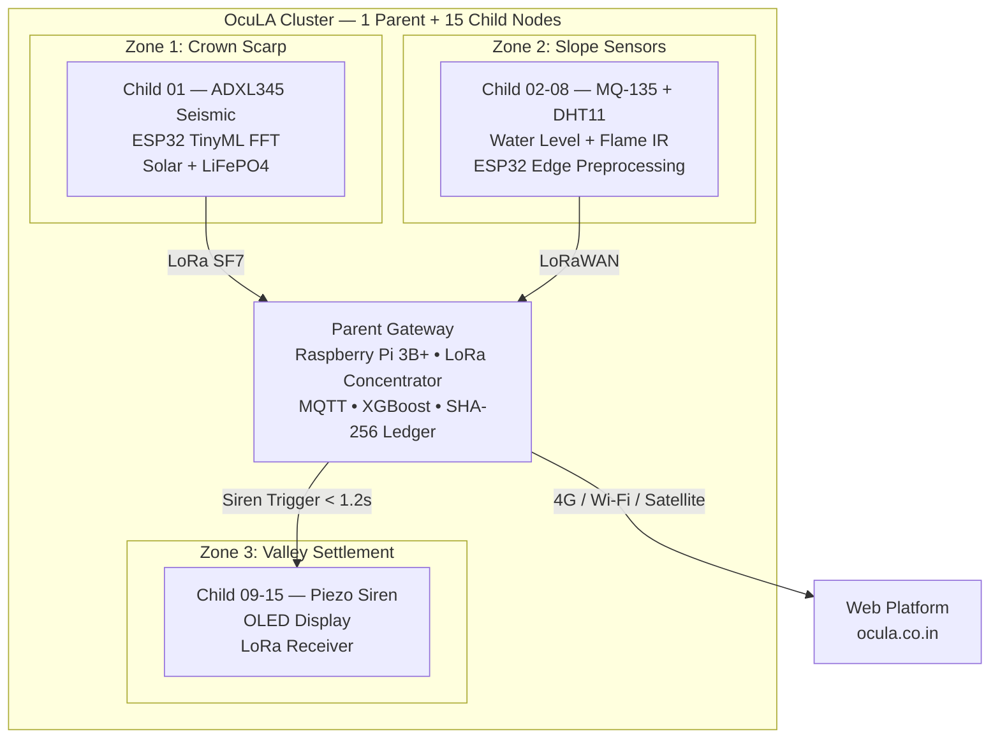

<div align="center">

# 🌐 OcuLA — Ocular Layer Architecture

### Autonomous Multi-Hazard Environmental Intelligence Platform

[](https://ocula.co.in)
[](https://ocula.co.in/audit)
[](https://vercel.com)
[](https://sih.gov.in/)
[](https://www.arduino.cc/)

**Real-time multi-hazard GIS mapping • Live USB sensor streaming • 3D planetary globe • AI Copilot**

</div>

---

## Table of Contents

- [Web Application](#-web-application)
- [Audit Hub](#-audit-hub)
- [System Architecture](#-system-architecture)
- [Hardware & WebSerial Setup](#-hardware--webserial-setup)
- [Repository Structure](#-repository-structure)
- [Deployment](#-deployment)
- [Research & Supplementary Materials](#-research--supplementary-materials)
- [License](#-license)

---

## 🌐 Web Application

**Live → [ocula.co.in](https://ocula.co.in)** · Source: [`ocula-web-app/`](ocula-web-app/)

The primary public-facing platform for citizens, disaster authorities, and field researchers. A zero-build vanilla SPA — no Node.js, no bundler, runs natively in the browser.

### Features

- **Live USB Sensor Streaming** — Plug an Arduino Uno R4 / ESP32 directly into your laptop and stream environmental data in real time via the browser's native [WebSerial API](https://developer.mozilla.org/en-US/docs/Web/API/Web_Serial_API). Supports JSON, CSV, key-value, and raw ADC formats.
- **Multi-Hazard GIS Map** — Leaflet-based vector tile map with 60+ worldwide monitoring hotspots across **7 hazard layers**: Flood, Wildfire, Landslide, AQI, Temperature, Earthquake, and Urban Heat Island.
- **3D Planetary Globe** — Three.js photorealistic Earth with atmospheric scattering, day/night terminator, orbital satellite tracks, and Aerosol Optical Depth (AOD) visualization.
- **AI Copilot** — Gemini 2.0 Flash-powered assistant (via OpenRouter) for environmental data interpretation, emergency protocols, and sensor calibration. Includes offline NLP fallback.
- **Cryptographic Auth** — SHA-256 hashed admin verification via `crypto.subtle`.

### Tech Stack

| Layer | Technology |
|---|---|
| UI | Vanilla HTML5 / CSS3 / ES6+ — no framework, no build step |
| GIS | Leaflet 1.9.4 (vendored) + Google Vector Tiles |
| 3D Globe | Three.js r128 (CDN) |
| Charts | Chart.js (CDN) |
| AI | OpenRouter → Gemini 2.0 Flash |
| Hardware | WebSerial API (Chrome, Edge, Brave, Opera) |
| Design System | Apple HIG-inspired Space Black / Cupertino Light |

---

## 🛡️ Audit Hub

**Live → [ocula.co.in/audit](https://ocula.co.in/audit)** · Source: [`ocula-audit-hub/`](ocula-audit-hub/)

The administrative security command center for network operators and emergency coordinators.

- **Device Registry** — Real-time GPS/GeoIP mapping of all connected sessions.
- **Remote Killswitch** — Instant session revocation and IP blacklisting across the mesh.
- **Cryptographic Audit Ledger** — Append-only log of all authentications, hardware events, and threshold triggers.
- **Obsidian Dark HUD** — Glassmorphic command-post styling for low-light environments.

---

## 🏗️ System Architecture

OcuLA implements a **2-tier star-mesh topology** for off-grid reliability and sub-second actuation:



---

## 🔌 Hardware & WebSerial Setup

> Chromium-based browsers (Chrome, Edge, Opera, Brave) grant full WebSerial access over HTTPS.

### Quick Start

1. Connect your **Arduino Uno R4 / ESP32** via USB.
2. Open **[ocula.co.in](https://ocula.co.in)** in Chrome or Edge.
3. Click **`⚡ Connect Sensor`** in the header.
4. Select your board's serial port (e.g., `COM3` on Windows, `/dev/ttyUSB0` on Linux).
5. Live readings stream immediately onto the HUD dials and trend charts.

### Pinout Reference

```
ESP32 / Arduino Uno R4:
├── ADXL345 Accelerometer   →  SPI (SCK: 18, MISO: 19, MOSI: 23, CS: 5)
├── MQ-135 Gas / AQI        →  Analog (GPIO 34)
├── DHT11 Temp & Humidity   →  Digital (GPIO 4)
├── Water Level Probe       →  Analog (GPIO 35)
├── Flame IR Sensor         →  Digital (GPIO 27)
├── Piezo Siren             →  PWM (GPIO 25)
└── 128x64 OLED (I2C)      →  SDA: 21, SCL: 22
```

---

## 📁 Repository Structure

```
OcuLA/
├── README.md                        # This file
├── vercel.json                      # Root reverse-proxy & edge routing
├── .gitignore
├── .gitattributes
│
├── ocula-web-app/                   # Main production web platform (SPA)
│   ├── index.html                   #   Application entry point
│   ├── app.js                       #   Core controller & WebSerial driver
│   ├── data.js                      #   Hotspot catalog & sensor data
│   ├── map.js                       #   Multi-hazard GIS engine
│   ├── globe.js                     #   3D Three.js planetary globe
│   ├── assistant.js                 #   AI Copilot module
│   ├── earth_textures.js            #   Base64 globe textures
│   ├── styles.css                   #   Design system stylesheet
│   └── assets/                      #   Logos, Leaflet vendor, textures
│
├── ocula-audit-hub/                 # Security & audit command center
│   ├── index.html                   #   Audit HUD interface
│   ├── audit.js                     #   Auth, killswitch & telemetry
│   ├── styles.css                   #   Dark HUD styling
│   └── assets/                      #   Leaflet vendor & logos
│
└── research/                        # Supplementary research & presentations
    ├── methodology/                 #   Wayanad case study & charts
    ├── presentation/                #   SIH 2026 pitch deck
    └── visuals/                     #   Infographics & visual exhibits
```

---

## 🚀 Deployment

The repository deploys to Vercel with zero configuration. Any push to `main` triggers an instant production deployment.

```bash
git add .
git commit -m "feat: update platform"
git push origin main
```

### Edge Routing

| Request Path | Served From |
|---|---|
| `/` | `ocula-web-app/index.html` |
| `/audit` | `ocula-audit-hub/index.html` |

Security headers (HSTS, `X-Frame-Options`, `X-Content-Type-Options`, `X-XSS-Protection`) are applied across all routes via [`vercel.json`](vercel.json).

---

## 📚 Research & Supplementary Materials

The [`research/`](research/) directory contains supporting research, presentations, and visual assets developed for the SIH 2026 submission:

| Document | Description |
|---|---|
| [`ocula_wayanad_methodology.pdf`](research/methodology/ocula_wayanad_methodology.pdf) | 12-page geotechnical case study — Wayanad 2024 landslide counterfactual analysis |
| [`ocula_wayanad_methodology.typ`](research/methodology/ocula_wayanad_methodology.typ) | Typst source for the methodology dossier |
| [`The_Code_Alchemists_SIH2026.pdf`](research/presentation/The_Code_Alchemists_SIH2026.pdf) | Official SIH 2026 pitch deck |
| [`research/visuals/`](research/visuals/) | Interactive HTML infographics and competitive analysis |

The methodology paper includes infinite slope stability analysis, debris flow kinematics, evacuation margin calculations (19.4 min survival buffer), latency analysis (40,500× improvement), acoustic siren propagation models, and a full bill of materials (₹60,000 per 16-node cluster).

---

## 📜 License

**Team**: The Code Alchemists · **Competition**: Smart India Hackathon 2026 (SIH26178)

MIT License — open for research and public environmental monitoring deployments.

<div align="center">
<b>Built for resilience · Engineered for India's dark zones · OcuLA 2026</b>
</div>
